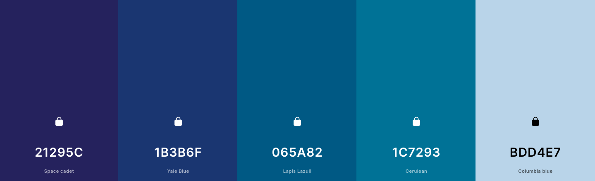
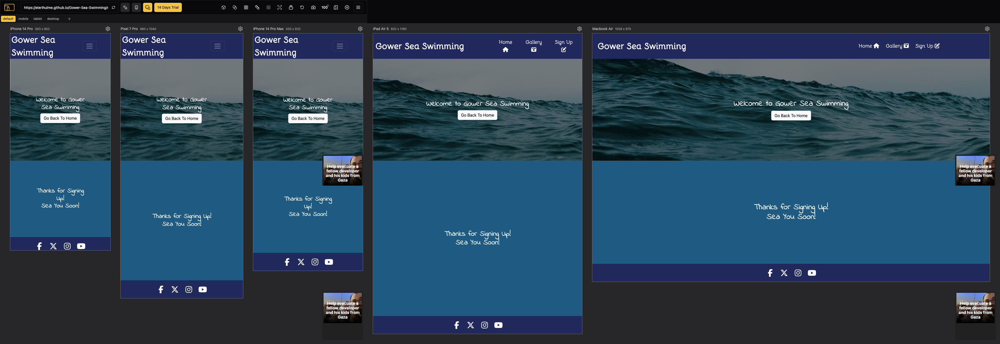

# Gower Sea Swimming

Welcome to the repository for the Cold Water Sea Swimmers website. This website aims to attract new members, inform visitors about the benefits and safety of cold water sea swimming, showcase past events, and facilitate easy sign-up for events and membership.

The site can be accessed from this [link](https://elerihulme.github.io/Gower-Sea-Swimming/)

## Table of Contents

- [Project Overview](#project-overview)
- [Technologies Used](#technologies-used)
- [UX](#ux)
- [Features](#features)
- [Design](#design)
- [Testing](#testing)
- [Deployment](#deployment)
- [Future Improvements](#future-improvements)
- [Credits](#credits)
- [Acknowledgment](#acknowledgment)

## Project Overview

The Cold Water Sea Swimmers website consists of three main pages:
- **Home**: Provides information about the group’s mission, safety advice and regular swims.
- **Gallery**: Displays a collection of photos of beautiful local swimming location.
- **Sign Up**: Allows users to join the group and participate in events.

## Technologies Used

- **HTML**: Structure of the website.
- **CSS**: Styling and layout.
- **Bootstrap**: Responsive layouts.
- **Balsamiq**: Make wireframes.
- **GitPod**: Main tool to write and edit code.
- **Git**: Version control.
- **GitHub**: Host the code of the website.
- **GitHub Pages**: Website deployment.

## UX

### Strategy

#### User Goals

* Opportunity to find a group to safely enjoy ocean swimming with likeminded people.
* Find information about when and where the group meet
* Discover the benefits of cold water swimming

#### Site Owner Goals

* Increase the number of people in the group
* Promote the benefits of cold water swimming
* Provide information about saftey
* Provide an easy way to keep group members updated about upcoming events

#### User Stories

##### First Time Visitor Goals:

* To be able to quickly understand the purpose of the website
* To be able to intuitively navigate through the website to find any content of interest
* To be able to easily find the information about where the swims take place and when
* To be able to understand the ethos and aims of the club

##### Returning VisitorGoals:

* Navigate quickly to find the information I need
* To be able to contact the group leaders to ask any questions

##### Frequent Visitor Goals:

* To be able to see what new events are coming up.
* To be able to see any updates to upcoming events

### Scope

- **Content Requirements**: Information about the group's mission, health benefits of sea swimming, safety rules, and upcoming events.
- **Functionality Requirements**: Responsive design, intuitive navigation, accessible content, and an engaging photo gallery.

### Structure

- **Hierarchical Structure**: The website is organized into sections, including Home, About Us, Health Benefits, Sea Safety Rules, Events, and Gallery.
- **Navigation**: A fixed navigation bar allows users to easily access different sections of the website.

### Skeleton

- **Wireframes**: Wireframes were created to outline the layout and structure of each page, ensuring a logical flow of information and ease of use.
- **Layout**: The layout uses a grid system (Bootstrap) to ensure consistency and responsiveness across different devices.

### Surface

- **Visual Design**: The design focuses on a clean and modern aesthetic, with a color scheme that reflects the sea and nature.
- **Typography**: Readable and accessible fonts are used to ensure a pleasant reading experience.
- **Imagery**: High-quality images of the beach and sea swimming events enhance the visual appeal and engagement of the website.

## Features

### Navigation Bar

* The navigation bar is visible on all pages. 
* The left side of navigation bar features the business logo which links to the home page from every page on the site as this is expected by the user.
* Links to each of the three pages of the site: Home, Gallery, and Sign Up are conventionally positioned on the right as expected by the user. 
* The page link underlines when the page active on the website to indicate to the user where they are on the site.
* When the mouse hovers over a page link the background colour of the link turns blue in keeping with the colour scheme of the site and provides easy navigation for the user.

- The navigation bar is responsive:

   * On mobile devices: 
      - navigation bar filled with the logo to the right and a hamburger menu implemented on the right-hand side of the navigation bar.     
      - When the hamburger menu is clicked, there is dropdown menu with the links in the same order.

### Footer

* The footer is visible on all pages so that address and social media links are always available to the user

### Home Page

- The home page provides the most important information about the group demonstrating the groups aims and ethos
- The home page is reponsive. On desktop the events section takes up 1/3 of the right hand side of the screen, but on tablet and mobile devices it moves below the other sections of content.  

##### Hero Section

- Hero section has a fixed background image.
- Hero section has a block section over the image that consists of:
   * Welcome message.
   * Sign up button that leads directly to the sign up page with a hover effect so the user knows that the button is usable.

##### About Us Section

- This is the first section on the page as it describes the main information about the group, which is a priority for users.

#### Health Benefits Section

- This section bullet points the main benefits of cold water swimming, divided into physical and mental benefits to make it easy for the user to understand
- This section is responsive as on a desktop the two categories appear next to each other but are stacked on tablet and mobile devices.

#### Swim Saftey Section

- This section hightlight to user the saftey consideration of sea swimming, reminding them of the potential dangers
- Each "rule" has an accompanying cartoon to emphasise each point and to make the content easier to take in.
- This section is repsonsive as the number of rules on each line decreases as the screen width gets narrower.

#### Events Section

- This section provide a list of the upcoming group events with details of place and time
- When viewed on a desktop this section is an aside to the right of the screen, but when on a tablet it falls below the other content on the page.

### Gallery

- This page highlights some of the places that group go swimming
- This apge is responsive as the number of images in a row decreases as the page width narrows

### Sign Up

- This page allows user to sign up for email updates so that they will never miss an event or any other update from the group organisers
The name and the email inputs are requireed to be filled out
- The submit button leads to a response page allowing the user to know that their submission was successful.

## Design

### Colour Scheme

- Different shades of blue were used as this is a colour associated with the sea and is aslo calming

### Typography

- Google font's Bellota and Indie Flower were used for the headings and main content respectively as the curly nature of both of these fonts is eye catching but also gives a sense of informality giving the page a friendly nature like the environment the group is trying to create.

### Wireframes

#### Mobile devices

- [Home Page. Mobile Screen](documentation/index-mobile.png)
- [Gallery Page. Mobile Screen](documentation/gallery-mobile.png)
- [Sign Up Page. Mobile Screen](documentation/signup-mobile.png)
- [Response Page. Mobile Screen](documentation/signup-complete-mobile.png)

#### Tablets

- [Home Page. Tablet Screen](documentation/index-tablet.png)
- [Gallery Page. Tablet Screen](documentation/gallery-tablet.png)
- [Sign Up Page. Tablet Screen](documentation/signup-tablet.png)
- [Response Page. Tablet Screen](documentation/signup-complete-tablet.png)

#### Desktop

- [Home Page. Desktop Screen](documentation/index-desktop.png)
- [Gallery Page. Desktop Screen](documentation/gallery-desktop.png)
- [Sign Up Page. Desktop Screen](documentation/signup-desktop.png)
- [Response Page. Desktop Screen](documentation/signup-complete-desktop.png)

## Testing

### Validation

* [HTML Validator](https://validator.w3.org/) was run on each page to determine any HTML errors. The only error found on each page was for the type attribute of buton on an a tag, this was taken from Bootstrap, and I don't believe it is necessarily an error. More information can be found [here](https://developer.mozilla.org/en-US/docs/Web/HTML/Element/button).

* [CSS Validator](https://validator.w3.org/) was run on the style sheet and there were no errors found.

* Lighthouse in Chrome Developer Tools was used to check performance and picked up some early contrast errors in colour choice so colours were adjusted accordingly. No other significant errors were found.

### Compatibility and Responsiveness

The website was tested on Chrome, Mozilla, Edge and Safari browsers with no problems found.

The website was tested on numerous sized screens including different desktop, tablet and mobile and was found to respond as expected to all sizes.

Chrome development tools was used throughout the design process to check responsiveness and breakpoints. Adjustments were made accordingly.

### Manual testing

| Feature | Action | Expected Result | Tested | Passed | Comments |
| --- | --- | --- | --- | --- | --- |
| Navbar | | | | | |
| Logo | Click on the logo text | The user is directed to the main page | Yes | Yes | - |
| Home | Click on the "Home" link | The user is redirected to the main page | Yes | Yes | - |
| Gallery | Click on the "Gallery" link | The user is redirected to the gallery page | Yes | Yes | - |
| Sign Up | Click on the "SIgn Up" link | The user is redirected to the sign up page | Yes | Yes | - |
| Footer | | | | | |
| Instagram icon in the footer | Click on the Instagram icon | The user is redirected to the Instagram page | Yes | Yes | - |
| Facebook icon in the footer | Click on the Facebook icon | The user is redirected to the Facebook page | Yes | Yes | - |
| X icon in the footer | Click on the X icon | The user is redirected to the X page | Yes | Yes | - |
| YouTube icon in the footer | Click on the YouTube icon | The user is redirected to the YouTube page | Yes | Yes | - |
| Home page | | | | | |
| "Sign Up" button in Hero section | Click on the "Sign Up" button | The user is redirected to the Sign Up page | Yes | Yes | - |
| Gallery page | | | | | |
| "Sign Up" button in Hero section | Click on the "Sign Up" button | The user is redirected to the contact page | Yes | Yes | - |
| Contact page | | | | | |
| Name input | Enter name | The name is entered | Yes | Yes | If user doesn't enter a name, the error message appears |
| Email input | Enter the email | The email is entered | Yes | Yes | If user doesn't enter the email, the error message appears. If user enters not valid email, the error message appears |
| Message text box | Type message in the text box | Message appears in the text box | Yes | Yes | Message is not required as user doesn't need to send a message to sign up |
| "Submit" button | Click on the "Submit" button | The user is redirected to the sign up complete page | Yes | Yes | - |

### Bugs

#### Solved Bugs
1. When centering my title on my hero image and adding an opaque overlay to make the text more visible, the title was staying at the top of the page
2. When adding my gallery images, they weren't filling the whole of the screen.

#### Unsolved Bugs

### Mistakes

When commiting changes I was using the past tense for my commit messages. Therefore halfway trhough the project wehn I realised my mistake I changed to using present tense.

## Deployment

### Deployment to GitHub Pages

- The site was deployed to GitHub pages. The steps to deploy are as follows: 
  - In the [GitHub repository](https://github.com/elerihulme/Gower-Sea-Swimming/), navigate to the Settings tab 
  - From the source section drop-down menu, select the **Main** Branch, then click "Save".
  - The page will be automatically refreshed with a detailed ribbon display to indicate the successful deployment.

The live link can be found [here](https://elerihulme.github.io/Gower-Sea-Swimming/)

### Local Deployment

In order to make a local copy of this project, you can clone it.
In your IDE Terminal, type the following command to clone my repository:

- `git clone https://github.com/elerihulme/Gower-Sea-Swimming.git`

- Alternatively, if you use Gitpod, you can [click here](https://elerihulme-gowerseaswim-4qu1qyuo6oa.ws.codeinstitute-ide.net/), which will start the Gitpod workspace for you.

## Future Improvements

- Add a fully functional sign up form.
- Add a custom 404 page.
- Add customised favicon.

## Credits

### Content

- [Bootstrap](https://getbootstrap.com/) was used for content structure, navigation elements, buttons and forms.
- [Font Awesome](https://fontawesome.com/) was used for all icons.
- Code was taken from [Materialize](https://materializecss.com/footer.html) to push the footer to the bottom of each page regardless of the content size. 

### Images

- All the images for this website were taken from [Unsplash](https://unsplash.com/).
+ [Hero image](https://unsplash.com/photos/time-lapse-photography-of-body-of-water-PKEPAeMBOIU)
+ Gallery images:
   - [Image 1](https://unsplash.com/photos/a-view-of-a-beach-with-a-hill-in-the-background-161rpKqzcKM)
   - [Image 2](https://unsplash.com/photos/a-large-body-of-water-sitting-next-to-a-lush-green-forest-GN9F_89Nve8)
   - [Image 3](https://unsplash.com/photos/a-beach-with-cabo-de-la-vela-on-it-xpfQZxvOuXE)
   - [Image 4](https://unsplash.com/photos/lighthouse-on-hill-9g3T6iO6l5U)
   - [Image 5](https://unsplash.com/photos/a-person-walking-on-a-beach-qx1_4g93RtQ)
   - [Image 6](https://unsplash.com/photos/aerial-view-photography-of-shore-between-cliffs-during-daytime-4585pXw9jsU)
   - [Image 7](https://unsplash.com/photos/ocean-waves-crashing-on-shore-during-daytime-8dNnGQDhnM4)
   - [Image 8](https://unsplash.com/photos/brown-cliffs-by-a-beach-landscape-BoHEJDXQANw)
   - [Image 9](https://unsplash.com/photos/aerial-view-of-green-and-brown-island-TcOn3c84E58)
   - [Image 10](https://unsplash.com/photos/an-aerial-view-of-a-sandy-beach-and-a-body-of-water-xUIbCuZW8ig)
   - [Image 11](https://unsplash.com/photos/island-surround-by-blue-ocean-water-ZYtE2vp0ML8)
   - [Image 12](https://unsplash.com/photos/a-sandy-beach-next-to-a-rocky-cliff-2LdNjUl79sk)

   ### Tools

   - [Optimizilla](https://imagecompressor.com/) was used to compress the gallery images.
   - [Image Resizer](https://imageresizer.com/) was used to resize and crop the gallery images.
   - [Coolers](https://coolors.co/) was used to create the colour palette.

## Acknowledgments

- [Julia Konovalova](https://github.com/IuliiaKonovalova) was a great mentor throughout this project, guiding me to help shape the project and bring it to life.
- [Code Institute](https://codeinstitute.net/) for the knowledge to complete a project like this and to the tutors and slack community for their support and help.
- My friends and family for their feedback adn help in testing the site.

---
